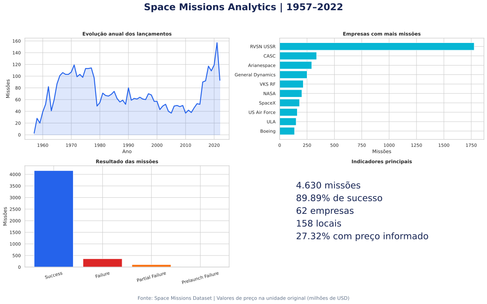

# Space Missions Analytics

Análise ponta a ponta de **4.630 missões espaciais realizadas entre 1957 e 2022**. O projeto demonstra um fluxo completo de dados: arquivo CSV bruto, limpeza com Python, modelagem relacional no MariaDB, consultas SQL e visualizações orientadas a negócio.



## Principais resultados

- **4.162 missões bem-sucedidas**, taxa geral de sucesso de **89,89%**.
- **357 falhas**, **107 falhas parciais** e **4 falhas antes do lançamento**.
- A base reúne **62 empresas**, **158 locais de lançamento** e **370 combinações de foguete/status**.
- `RVSN USSR` lidera em volume, com **1.777 missões**.
- `Cosmos-3M (11K65M)` é o foguete mais recorrente, com **446 missões**.
- O preço está disponível em apenas **1.265 registros (27,32%)**. Por isso, valores financeiros são analisados separadamente e não representam todo o histórico.

## Perguntas respondidas

1. Como o volume de lançamentos evoluiu ao longo do tempo?
2. Quais empresas e foguetes realizaram mais missões?
3. Qual é a distribuição dos resultados das missões?
4. Quais empresas combinam maior volume com melhor taxa de sucesso?
5. Como os valores informados se distribuem e qual é a limitação dessa análise?

## Tecnologias

`Python` · `Pandas` · `MariaDB` · `SQL` · `Matplotlib` · `Seaborn` · `Git`

## Estrutura

```text
space-missions-analytics/
├── data/raw/space_missions.csv       # fonte original, preservada
├── data/processed/                   # tabelas analíticas geradas
├── docs/                             # modelo e dicionário de dados
├── images/dashboard/                 # gráficos finais
├── scripts/import_data.py            # ETL CSV -> MariaDB
├── scripts/analyze_data.py           # análise reproduzível sem banco
├── sql/create_tables.sql             # criação do modelo relacional
├── sql/queries.sql                   # consultas e KPIs
└── requirements.txt
```

## Como executar

### 1. Análise e gráficos

```bash
python -m venv .venv
source .venv/bin/activate  # Windows: .venv\Scripts\activate
pip install -r requirements.txt
python scripts/analyze_data.py
```

Os resultados são gravados em `data/processed/` e `images/dashboard/`.

### 2. ETL para MariaDB

Crie o banco com `sql/create_tables.sql`, copie `.env.example` para `.env`, preencha as credenciais e execute:

```bash
python scripts/import_data.py
```

Depois, utilize `sql/queries.sql` para reproduzir os indicadores.

## Modelo de dados

O CSV foi normalizado em quatro tabelas: `companies`, `locations`, `rockets` e `missions`. A tabela de missões guarda as métricas e se relaciona às dimensões por chaves estrangeiras. Consulte [docs/modelo-banco.md](docs/modelo-banco.md).

## Qualidade e limitações

- O arquivo em `data/raw/` não é alterado pelo pipeline.
- Há **127 horários ausentes** e **3.365 preços ausentes**.
- O campo `Price` é mantido na unidade original do dataset (milhões de dólares).
- Os resultados descrevem a base disponível; não devem ser interpretados como inventário oficial completo de todos os lançamentos espaciais.

## Autor

**Eder Felix Silva** — estudante de Análise e Desenvolvimento de Sistemas, com foco em Dados.
