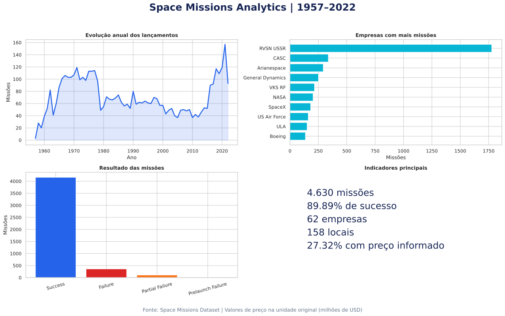

# Space Missions Analytics

Análise exploratória de **4.630 registros de missões espaciais entre 1957 e 2022**. O projeto demonstra dois fluxos: análise direta do CSV com Python/Pandas, que gera tabelas analíticas e um painel estático com Matplotlib/Seaborn; e ETL para MariaDB, com modelagem relacional e consultas SQL para indicadores.



## Principais resultados

- **4.162 missões bem-sucedidas**, taxa geral de sucesso de **89,89%**.
- **357 falhas**, **107 falhas parciais** e **4 falhas antes do lançamento**.
- A base reúne **62 empresas**, **158 locais de lançamento** e **370 combinações de foguete/status**.
- `RVSN USSR` lidera em volume, com **1.777 missões**.
- `Cosmos-3M (11K65M)` é o foguete mais recorrente, com **446 missões**.
- O preço está disponível em **1.265 registros (27,32%)**. A consulta 9 de `sql/queries.sql` calcula cobertura, média, mínimo e máximo considerando os preços preenchidos; essas estatísticas não representam todo o histórico.

## Perguntas respondidas

1. Como o volume de lançamentos evoluiu ao longo do tempo?
2. Quais empresas e foguetes realizaram mais missões?
3. Qual é a distribuição dos resultados das missões?
4. Quais empresas combinam maior volume com melhor taxa de sucesso?
5. Qual é a cobertura do campo `Price` e quais são seus valores mínimo, médio e máximo nos registros preenchidos?

## Tecnologias

`Python` · `Pandas` · `MariaDB` · `SQL` · `Matplotlib` · `Seaborn` · `Git`

## Estrutura

```text
space-missions-analytics/
├── data/raw/space_missions.csv       # fonte original, preservada
├── data/processed/                   # tabelas analíticas geradas
├── docs/                             # modelo e dicionário de dados
├── images/dashboard/                 # gráficos finais
├── scripts/import_data.py            # ETL CSV -> MariaDB
├── scripts/analyze_data.py           # análise reproduzível sem banco
├── sql/create_tables.sql             # criação do modelo relacional
├── sql/queries.sql                   # consultas e KPIs
└── requirements.txt
```

## Como executar

Clone o repositório e entre na pasta do projeto:

```bash
git clone https://github.com/ederfelixsilva/space-missions-analytics.git
cd space-missions-analytics
```

Execute os comandos abaixo a partir dessa pasta.

### 1. Análise e gráficos

```bash
python -m venv .venv
source .venv/bin/activate  # Windows: .venv\Scripts\activate
pip install -r requirements.txt
python scripts/analyze_data.py
```

Os resultados são gravados em `data/processed/` e `images/dashboard/`.

### 2. ETL para MariaDB

Utilize um servidor MariaDB em execução, com suporte a funções de janela (`OVER`). Instale as dependências e ative o ambiente virtual conforme a etapa anterior.

1. Execute `sql/create_tables.sql` no MariaDB para criar o banco `space_missions` e suas tabelas.
2. Copie `.env.example` para `.env`, na raiz do projeto.
3. Configure `DB_HOST`, `DB_PORT`, `DB_NAME`, `DB_USER` e `DB_PASSWORD`. Para os scripts SQL fornecidos, mantenha `DB_NAME=space_missions`.
4. Utilize um usuário com permissões para executar o SQL de criação e as operações de carga do ETL.

```bash
python scripts/import_data.py
```

Depois da carga, execute `sql/queries.sql` no MariaDB para consultar os indicadores.

**Comportamento de recarga:** `sql/create_tables.sql` remove e recria as quatro tabelas. Cada execução de `scripts/import_data.py` esvazia essas tabelas antes de carregar novamente o CSV.

## Modelo de dados

O CSV foi normalizado em quatro tabelas: `companies`, `locations`, `rockets` e `missions`. A tabela de missões guarda as métricas e se relaciona às dimensões por chaves estrangeiras. Consulte [docs/modelo-banco.md](docs/modelo-banco.md).

## Qualidade e limitações

- A base utilizada está disponível em [data/raw/space_missions.csv](data/raw/space_missions.csv), com **4.630 registros e 9 colunas**. A autoria e a URL de obtenção do dataset não estão documentadas neste repositório. Consulte o [dicionário de dados](docs/dicionario-de-dados.md) para as definições dos campos.
- O arquivo em `data/raw/` não é alterado pelo pipeline.
- Há **127 horários ausentes** e **3.365 preços ausentes**.
- O campo `Price` é mantido na unidade original do dataset (milhões de dólares).
- Os resultados descrevem a base disponível; não devem ser interpretados como inventário oficial completo de todos os lançamentos espaciais.

## Autor

**Eder Felix Silva** — estudante de Análise e Desenvolvimento de Sistemas, com foco em Dados.
